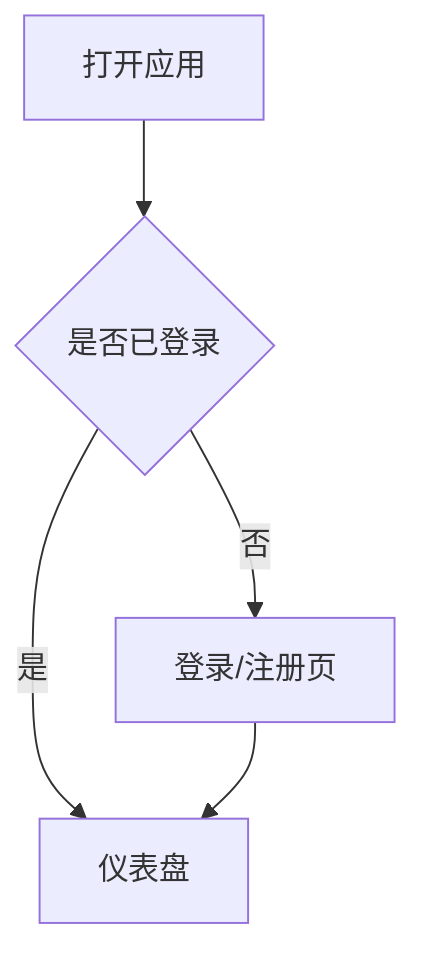
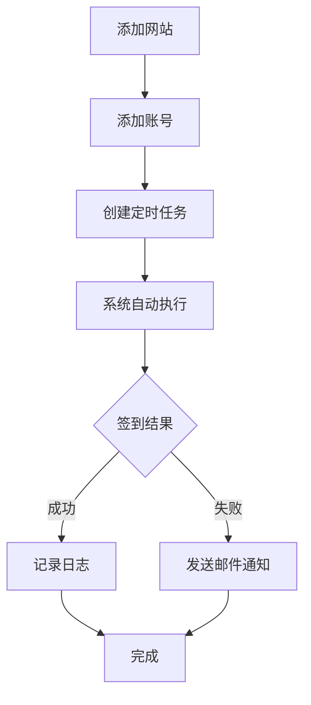

# Account-Auto-Sign V1 产品需求文档

## 1. 产品概述

Account-Auto-Sign 是一个支持多网站、多账号自动签到的平台，帮助用户自动化日常签到任务，减少重复性操作。

目标用户：需要管理多个网站账号并进行定期签到的用户。

## 2. 核心功能

### 2.1 用户角色

| 角色 | 注册方式 | 核心权限 |
|------|----------|----------|
| 普通用户 | 邮箱注册/登录 | 管理网站、账号、任务、查看日志 |

### 2.2 功能模块

1. **用户系统**：注册、登录、邮箱验证
2. **网站管理**：添加/编辑/删除支持签到的网站
3. **账号管理**：导入、批量添加、编辑、删除账号
4. **任务管理**：创建/编辑/删除定时签到任务
5. **签到日志**：查看历史签到结果
6. **邮件通知**：签到成功/失败时发送邮件通知

## 3. 页面清单

| 页面名称 | 模块名称 | 功能描述 |
|----------|----------|----------|
| 登录/注册页 | 认证模块 | 用户登录、注册、邮箱验证 |
| 仪表盘 | 概览模块 | 显示账号概览、任务状态、最近签到结果 |
| 网站管理页 | 网站列表 | 添加/编辑/删除网站，配置网站类型 |
| 账号管理页 | 账号列表 | CSV导入、批量添加、编辑、删除账号 |
| 任务管理页 | 任务列表 | 创建/编辑/删除定时任务，设置cron表达式 |
| 日志查看页 | 日志列表 | 查看历史签到日志，支持筛选和搜索 |
| 设置页 | 设置模块 | 邮件通知配置、个人信息管理 |

## 4. 核心流程

### 4.1 用户注册登录流程

### 4.2 添加账号并创建签到任务流程

## 5. 数据模型

### 5.1 Site 网站表

| 字段 | 类型 | 说明 |
|------|------|------|
| id | INTEGER | 主键，自增 |
| name | VARCHAR(100) | 网站名称 |
| type | VARCHAR(50) | 网站类型 |
| url | VARCHAR(500) | 网站URL |
| created_at | DATETIME | 创建时间 |

### 5.2 Account 账号表

| 字段 | 类型 | 说明 |
|------|------|------|
| id | INTEGER | 主键，自增 |
| site_id | INTEGER | 外键，关联Site |
| username | VARCHAR(100) | 用户名 |
| password | VARCHAR(255) | 密码（加密存储） |
| token | TEXT | Token |
| cookie | TEXT | Cookie |
| status | VARCHAR(20) | 状态：active/inactive |
| created_at | DATETIME | 创建时间 |

### 5.3 Task 任务表

| 字段 | 类型 | 说明 |
|------|------|------|
| id | INTEGER | 主键，自增 |
| account_id | INTEGER | 外键，关联Account |
| cron | VARCHAR(100) | Cron表达式 |
| last_run | DATETIME | 最后运行时间 |
| status | VARCHAR(20) | 状态：enabled/disabled |
| created_at | DATETIME | 创建时间 |

### 5.4 Log 日志表

| 字段 | 类型 | 说明 |
|------|------|------|
| id | INTEGER | 主键，自增 |
| task_id | INTEGER | 外键，关联Task |
| result | TEXT | 签到结果 |
| status | VARCHAR(20) | 状态：success/failed |
| created_at | DATETIME | 创建时间 |

### 5.5 User 用户表

| 字段 | 类型 | 说明 |
|------|------|------|
| id | INTEGER | 主键，自增 |
| email | VARCHAR(100) | 邮箱（唯一） |
| password | VARCHAR(255) | 密码（加密存储） |
| is_active | BOOLEAN | 是否激活 |
| created_at | DATETIME | 创建时间 |

## 6. 用户界面设计

### 6.1 设计风格

- **整体风格**：现代简洁，采用卡片式布局
- **主色调**：深蓝色 #1e3a5f 配合亮蓝色 #3b82f6
- **辅助色**：成功绿 #22c55e，警告橙 #f59e0b，错误红 #ef4444
- **字体**：使用 Inter 作为主字体
- **布局**：顶部导航 + 侧边栏菜单
- **图标**：Lucide Icons

### 6.2 页面设计

| 页面名称 | 主要元素 |
|----------|----------|
| 登录/注册页 | Logo、表单、提交按钮 |
| 仪表盘 | 统计卡片、快捷操作、最近日志 |
| 网站管理页 | 表格、操作按钮、添加/编辑弹窗 |
| 账号管理页 | 表格、导入按钮、筛选器 |
| 任务管理页 | 表格、Cron编辑器、启用/禁用开关 |
| 日志查看页 | 日志列表、时间筛选器、状态筛选器 |

### 6.3 响应式设计

- 采用桌面优先设计
- 支持平板和移动端自适应
- 侧边栏可折叠
