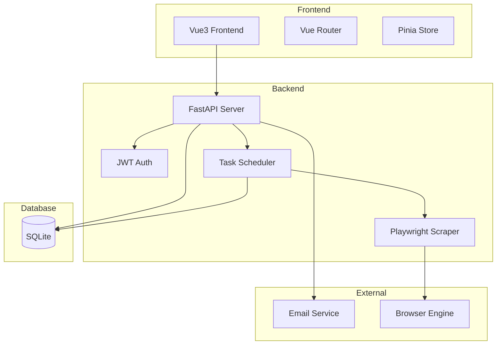
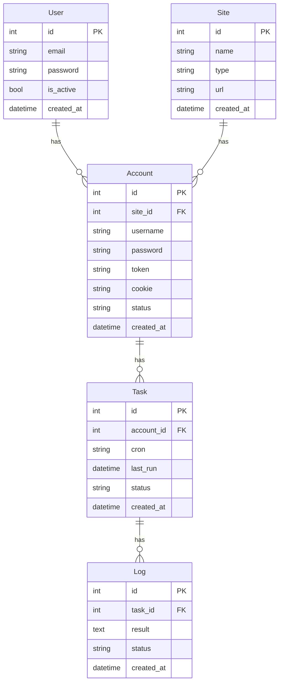
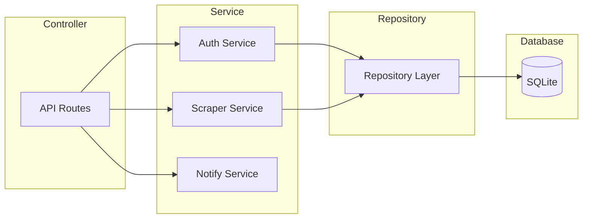

# Account-Auto-Sign V1 技术架构文档

## 1. 架构设计



## 2. 技术栈

### 前端
- **框架**：Vue 3 + TypeScript
- **UI 库**：Element Plus
- **状态管理**：Pinia
- **路由**：Vue Router
- **构建工具**：Vite

### 后端
- **框架**：Python 3.11 + FastAPI
- **数据库**：SQLite + SQLAlchemy
- **任务调度**：APScheduler
- **浏览器自动化**：Playwright
- **邮件**：aiosmtplib

### 部署
- **容器化**：Docker + Docker Compose
- **反向代理**：Nginx

## 3. 项目目录结构

```
backend/
├── api/
│   ├── __init__.py
│   ├── routes/
│   │   ├── __init__.py
│   │   ├── auth.py
│   │   ├── sites.py
│   │   ├── accounts.py
│   │   ├── tasks.py
│   │   └── logs.py
│   └── deps.py
├── models/
│   ├── __init__.py
│   ├── user.py
│   ├── site.py
│   ├── account.py
│   ├── task.py
│   └── log.py
├── schemas/
│   ├── __init__.py
│   ├── user.py
│   ├── site.py
│   ├── account.py
│   ├── task.py
│   └── log.py
├── services/
│   ├── __init__.py
│   ├── auth.py
│   ├── scraper.py
│   └── notification.py
├── plugins/
│   ├── __init__.py
│   ├── base.py
│   ├── openrouter.py
│   ├── forum.py
│   └── custom.py
├── tasks/
│   ├── __init__.py
│   └── scheduler.py
├── core/
│   ├── __init__.py
│   ├── config.py
│   ├── database.py
│   └── security.py
└── main.py

frontend/
├── src/
│   ├── api/
│   ├── components/
│   ├── views/
│   ├── router/
│   ├── stores/
│   ├── utils/
│   └── App.vue
├── package.json
└── vite.config.ts

plugins/
├── openrouter/
├── forum/
└── custom/
```

## 4. API 定义

### 4.1 认证模块

| 接口 | 方法 | 说明 |
|------|------|------|
| /api/auth/register | POST | 用户注册 |
| /api/auth/login | POST | 用户登录 |
| /api/auth/me | GET | 获取当前用户 |

### 4.2 网站管理

| 接口 | 方法 | 说明 |
|------|------|------|
| /api/sites | GET | 获取网站列表 |
| /api/sites | POST | 创建网站 |
| /api/sites/{id} | PUT | 更新网站 |
| /api/sites/{id} | DELETE | 删除网站 |

### 4.3 账号管理

| 接口 | 方法 | 说明 |
|------|------|------|
| /api/accounts | GET | 获取账号列表 |
| /api/accounts | POST | 创建账号 |
| /api/accounts | POST | 批量导入账号 |
| /api/accounts/{id} | PUT | 更新账号 |
| /api/accounts/{id} | DELETE | 删除账号 |
| /api/accounts/import | POST | CSV导入 |

### 4.4 任务管理

| 接口 | 方法 | 说明 |
|------|------|------|
| /api/tasks | GET | 获取任务列表 |
| /api/tasks | POST | 创建任务 |
| /api/tasks/{id} | PUT | 更新任务 |
| /api/tasks/{id} | DELETE | 删除任务 |
| /api/tasks/{id}/run | POST | 手动执行任务 |

### 4.5 日志管理

| 接口 | 方法 | 说明 |
|------|------|------|
| /api/logs | GET | 获取日志列表 |
| /api/logs | DELETE | 删除日志 |

## 5. 数据模型



## 6. DDL 语句

### SQLite 数据库初始化

```sql
CREATE TABLE users (
    id INTEGER PRIMARY KEY AUTOINCREMENT,
    email VARCHAR(100) UNIQUE NOT NULL,
    password VARCHAR(255) NOT NULL,
    is_active BOOLEAN DEFAULT 1,
    created_at DATETIME DEFAULT CURRENT_TIMESTAMP
);

CREATE TABLE sites (
    id INTEGER PRIMARY KEY AUTOINCREMENT,
    name VARCHAR(100) NOT NULL,
    type VARCHAR(50) NOT NULL,
    url VARCHAR(500),
    created_at DATETIME DEFAULT CURRENT_TIMESTAMP
);

CREATE TABLE accounts (
    id INTEGER PRIMARY KEY AUTOINCREMENT,
    site_id INTEGER NOT NULL,
    username VARCHAR(100) NOT NULL,
    password VARCHAR(255),
    token TEXT,
    cookie TEXT,
    status VARCHAR(20) DEFAULT 'active',
    created_at DATETIME DEFAULT CURRENT_TIMESTAMP,
    FOREIGN KEY (site_id) REFERENCES sites(id) ON DELETE CASCADE
);

CREATE TABLE tasks (
    id INTEGER PRIMARY KEY AUTOINCREMENT,
    account_id INTEGER NOT NULL,
    cron VARCHAR(100) NOT NULL,
    last_run DATETIME,
    status VARCHAR(20) DEFAULT 'enabled',
    created_at DATETIME DEFAULT CURRENT_TIMESTAMP,
    FOREIGN KEY (account_id) REFERENCES accounts(id) ON DELETE CASCADE
);

CREATE TABLE logs (
    id INTEGER PRIMARY KEY AUTOINCREMENT,
    task_id INTEGER NOT NULL,
    result TEXT,
    status VARCHAR(20) NOT NULL,
    created_at DATETIME DEFAULT CURRENT_TIMESTAMP,
    FOREIGN KEY (task_id) REFERENCES tasks(id) ON DELETE CASCADE
);

CREATE INDEX idx_accounts_site_id ON accounts(site_id);
CREATE INDEX idx_tasks_account_id ON tasks(account_id);
CREATE INDEX idx_logs_task_id ON logs(task_id);
CREATE INDEX idx_logs_created_at ON logs(created_at);
```

## 7. 服务器架构



## 8. 插件系统

插件目录结构：
```
plugins/
├── __init__.py
├── base.py          # 基础插件类
├── openrouter/      # OpenRouter 插件
│   ├── __init__.py
│   └── plugin.py
├── forum/           # 论坛插件
│   ├── __init__.py
│   └── plugin.py
└── custom/          # 自定义插件
    ├── __init__.py
    └── plugin.py
```

每个插件需要实现：
- `sign_in(account)` - 执行签到
- `validate()` - 验证配置
